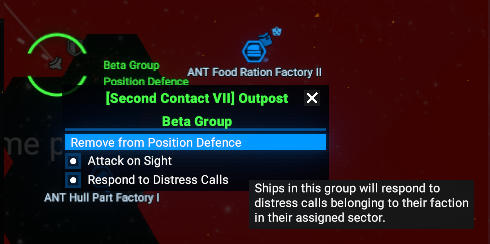

# X4 Distress Extended

A small extension for X4 that expands the fleet "Respond to Station Distress Calls" behavior.

When enabled on a fleet in "Position defense" mode, fleets will respond to attacks on any player ship or station in the sector — not just player-owned stations in the commander's sector.

## Features

- Extends the built-in distress-response behavior so fleets react to attacks on player ships and stations anywhere in the current sector.
- Works with fleets assigned to "Position defense" with the distress-response option enabled.

## Installation

1. Copy the folder into the game's `extensions` directory.
2. Start (or restart) X4. The extension is loaded automatically.

## Usage

1. Assign a fleet to the `Position defense` order.
2. Enable the `Respond to Station Distress Calls` option for that fleet.
3. With this extension active, the fleet will now respond when any player ship or station in the sector is attacked.

## Preview

Before / After (extension active):

## Compatibility

This mod has been test only with the last 8.00 beta version.

## License

This project is licensed under the terms in the `LICENSE` file in this repository.

## Contact

For questions or support, open an issue on this repository.